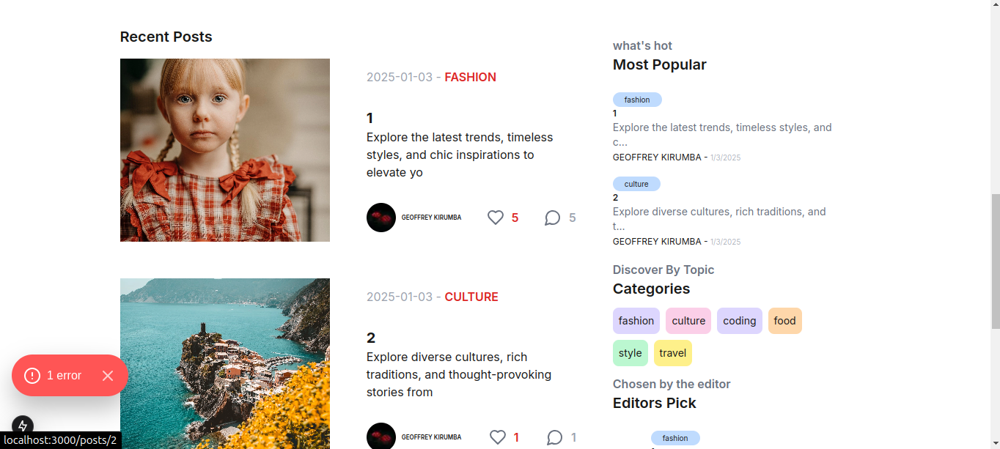
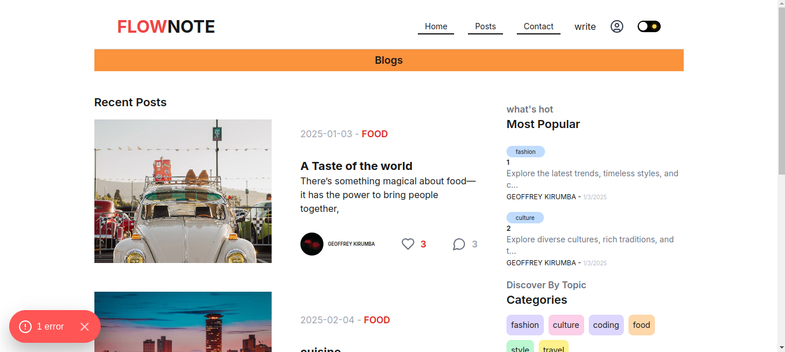

# Flownote

Flownote is a dynamic and intuitive platform designed to enhance content creation and sharing. Built with modern web technologies, it provides a seamless experience for users to compose, manage, and interact with notes, articles, and discussions.

# Overview







## Features

- **User Authentication**: Secure authentication and session management.
- **Content Management**: Create, edit, and publish notes and articles.
- **Rich Media Support**: Upload images and videos via Cloudinary.
- **Category Filtering**: Efficient filtering of posts by category.
- **Interactive Engagement**: Users can like and comment on posts.
- **Profile Management**: Personalized user profiles with customizable settings.
- **Optimized Performance**: Fast load times with server-side rendering and caching.

## Tech Stack

- **Frontend**: Next.js 15, React, Tailwind CSS
- **Backend**: Next.js API Routes, Prisma ORM, PostgreSQL
- **Authentication**: NextAuth.js
- **Storage**: Cloudinary for media files
- **Hosting**: Vercel

## Setup Instructions

1. Clone the repository:
   ```sh
   git clone https://github.com/your-username/flownote.git
   cd flownote
   ```

2. Install dependencies:
   ```sh
   npm install
   ```

3. Set up environment variables in a `.env` file:
   ```env
   DATABASE_URL=your_postgresql_database_url
   NEXTAUTH_URL=your_nextauth_url
   CLOUDINARY_URL=your_cloudinary_url
   ```

4. Run database migrations:
   ```sh
   npx prisma migrate dev
   ```

5. Start the development server:
   ```sh
   npm run dev
   ```

## Deployment

Flownote is optimized for deployment on Vercel. To deploy:

1. Push the repository to GitHub.
2. Connect the repository to Vercel.
3. Configure environment variables in Vercel's dashboard.
4. Deploy the project with a single click.

## Contribution

Contributions are welcome! Please fork the repository, create a feature branch, and submit a pull request.


